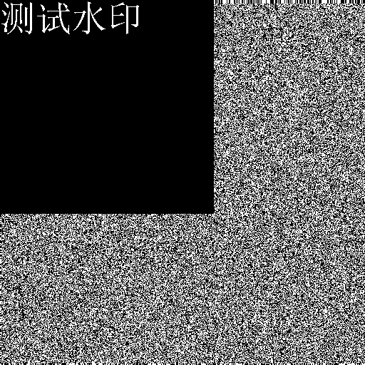
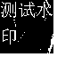
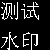

## LSB
### 简介
基于不可感知的要求，即数据的变化几乎不会引起使用的者的察觉，将水印信息嵌入到数据的最低有效位（Least Significant Bit）也就是将图片的RGB数值转换为二进制数据，然后用水印替换掉最低位，这种变化对于人眼来说是不可察觉的。当然，水印的形式也是多种多样的，有图片，文字等，这里主要介绍如何把图片作为水印写入到另一张图片中。
### 效果
|原图|含水印图|提取水印|
|---|---|---|
||||

## DCT
### 简介
在信号的频域(变换域)中隐藏信息要比在时域中嵌入信息具有更好的鲁棒性。一幅图像经过时域到频域的变换后，可将待隐藏信息嵌入图像的显著区域，这种算法更具抗攻击能力，而且保持了人类感官的不可察觉性。常用的变换域方法有离散余弦变换、离散小波变换和离散傅立叶变换等。相对于传统的DCT水印，本项目的DCT水印处理只放在RGB的B通道，因此也可以一定程度增强水印的隐藏。

### 效果
|原图|含水印图|提取水印|
|---|---|---|
||||

## DWT
### 简介
通过D W T算法可以实现图像的时频分解.将一维小波变换运用在图像等二维信号的行与列上，二维小波变换在变换之后得以构成，从而能够将源图像分成4个频率带.4个子带分别为低频近似子带、水平子带、垂直子带及对角线细节子带。图像集中在低频子频带，可以对它进行再次分解。DWT变换的优点非常明显，比如聚集能量效果好。传统的DWT水印需要进行灰度处理，本项目采用RGB图像单通道处理进行小波变换,则不必将图片进行灰度处理。

### 效果
|原图|含水印图|提取水印|
|---|---|---|
||||
